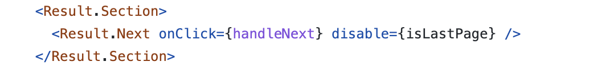
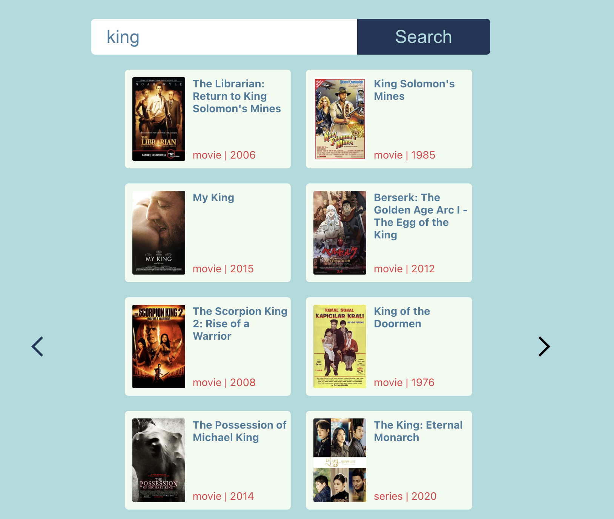

## Puesta en marcha.

Debes tener [node](https://nodejs.org/es/) y [yarn](https://yarnpkg.com/) instalados.
Entra en el directorio y ejecuta `yarn` para descargar las dependencias.
Después, simplemente ejecutando `yarn start` se arrancará la aplicación.

### this micro implementation allows you to set a theme and pass props to control css properties, you can find use case in the pagination.

